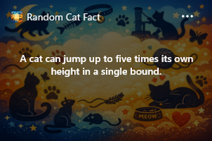

<a id="readme-top"></a>

<!-- PROJECT SHIELDS -->
[![Stargazers][stars-shield]][stars-url]
[![Issues][issues-shield]][issues-url]
[![MIT License][license-shield]][license-url]

<!-- PROJECT LOGO -->
<br />
<div align="center">
  <h1 align="center">Widgets Playground</h1>

  <p align="center">
    Learn to build Windows 11 widgets in C# — from zero to Widget Board
  </p>

  
</div>

<br />

<!-- TABLE OF CONTENTS -->
<details>
  <summary>Table of Contents</summary>
  <ol>
    <li><a href="#about-the-project">About The Project</a></li>
    <li><a href="#built-with">Built With</a></li>
    <li>
      <a href="#getting-started">Getting Started</a>
      <ul>
        <li><a href="#prerequisites">Prerequisites</a></li>
        <li><a href="#build-and-run">Build and Run</a></li>
      </ul>
    </li>
    <li><a href="#project-structure">Project Structure</a></li>
    <li><a href="#tutorial">Tutorial</a></li>
    <li><a href="#advanced-example">Advanced Example</a></li>
    <li><a href="#license">License</a></li>
    <li><a href="#acknowledgments">Acknowledgments</a></li>
  </ol>
</details>

## About The Project

A tutorial and reference repository for building native **Windows 11 widgets** with C# and Windows App SDK.

The main project (`src/Xakpc.Widgets.Playground`) implements a **Cat Fact widget** end-to-end — from COM activation and MSIX packaging to Adaptive Card rendering and user interaction. It is accompanied by a 13-step written tutorial and an advanced multi-widget example.

<p align="right">(<a href="#readme-top">back to top</a>)</p>

## Built With

* .NET 10
* Windows App SDK 1.8
* Adaptive Cards
* COM (Component Object Model)
* MSIX packaging

<p align="right">(<a href="#readme-top">back to top</a>)</p>

## Getting Started

### Prerequisites

* **Windows 11** (build 22000 or later)
* **.NET 10 SDK**
* **Visual Studio 2022+** with the *Windows App SDK* workload
* **Developer Mode** enabled (Settings > Privacy & security > For developers)

### Build and Run

1. Clone the repo
   ```sh
   git clone https://github.com/xakpc/widgets.playground.git
   ```
2. Open `src/Xakpc.Widgets.Playground/Xakpc.Widgets.Playground.csproj` in Visual Studio
3. Select the **MsixPackage** launch profile and build/deploy (F5)
4. Open the Windows **Widget Board** (Win + W) and add the *Cat Fact* widget

For a detailed walkthrough see the [tutorial](#tutorial) below.

<p align="right">(<a href="#readme-top">back to top</a>)</p>

## Project Structure

```
├── src/
│   └── Xakpc.Widgets.Playground/   # Tutorial widget — Cat Fact provider
├── example/
│   └── Xakpc.Widgets.Witals/       # Advanced example — multi-widget system vitals
└── tutorial/
    └── windows-widget/              # 13-step written guide
        ├── README.md
        └── steps/
```

<p align="right">(<a href="#readme-top">back to top</a>)</p>

## Tutorial

The full guide is also available as a blog post: [Create Your First Windows Widget with C#](https://xakpc.dev/windows-widgets/create-windows-widget/)

The source for the tutorial lives in [`tutorial/windows-widget/README.md`](tutorial/windows-widget/README.md). It covers every step from an empty project to a deployed widget:

1. [Architecture and Prerequisites](tutorial/windows-widget/steps/01-architecture-and-prereqs.md)
2. [Create and Configure the Base Project](tutorial/windows-widget/steps/02-create-project.md)
3. [Add Adaptive Card Templates](tutorial/windows-widget/steps/03-adaptive-card-template.md)
4. [Build the Cat Fact Service](tutorial/windows-widget/steps/04-catfact-service.md)
5. [Add the Widget State Model](tutorial/windows-widget/steps/05-widget-state.md)
6. [Implement the Widget Provider Lifecycle](tutorial/windows-widget/steps/06-widget-provider.md)
7. [Add COM Class Factory Boilerplate](tutorial/windows-widget/steps/07-com-factory.md)
8. [Wire the Program Entry Point](tutorial/windows-widget/steps/08-entry-point.md)
9. [Add Packaging and Manifest Declarations](tutorial/windows-widget/steps/09-packaging-and-manifest.md)
10. [Build, Deploy, and Test the Widget](tutorial/windows-widget/steps/10-build-deploy-test.md)
11. [Troubleshooting](tutorial/windows-widget/steps/11-troubleshooting.md)
12. [Production Extras](tutorial/windows-widget/steps/12-production-extras.md)
13. [Final Wrap-Up and Next Steps](tutorial/windows-widget/steps/13-next-steps.md)

<p align="right">(<a href="#readme-top">back to top</a>)</p>

## Advanced Example

The [`example/Xakpc.Widgets.Witals/`](example/Xakpc.Widgets.Witals/) project demonstrates patterns beyond the tutorial:

* **Multiple widgets** — CPU, GPU, Memory, and Network vitals in a single provider
* **Dependency injection** via `Microsoft.Extensions.DependencyInjection`
* **Polling data sources** that push live system metrics to the Widget Board
* **Widget customization** through Adaptive Card action handling

<p align="right">(<a href="#readme-top">back to top</a>)</p>

## License

Distributed under the MIT License. See `LICENSE` for more information.

<p align="right">(<a href="#readme-top">back to top</a>)</p>

## Acknowledgments

* [Windows App SDK — Widget providers](https://learn.microsoft.com/en-us/windows/apps/design/widgets/widget-providers-get-started)
* [catfact.ninja API](https://catfact.ninja/)
* [Adaptive Cards](https://adaptivecards.io/)
* [Best-README-Template](https://github.com/othneildrew/Best-README-Template)

<p align="right">(<a href="#readme-top">back to top</a>)</p>

<!-- MARKDOWN LINKS & IMAGES -->
[stars-shield]: https://img.shields.io/github/stars/xakpc/widgets.playground.svg?style=for-the-badge
[stars-url]: https://github.com/xakpc/widgets.playground/stargazers
[issues-shield]: https://img.shields.io/github/issues/xakpc/widgets.playground.svg?style=for-the-badge
[issues-url]: https://github.com/xakpc/widgets.playground/issues
[license-shield]: https://img.shields.io/github/license/xakpc/widgets.playground.svg?style=for-the-badge
[license-url]: https://github.com/xakpc/widgets.playground/blob/main/LICENSE
